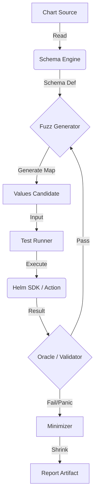

# Helm Fuzz

Automated Property-Based Testing for Helm Chart Templates

## Overview

Helm charts often crash during deployment due to unhandled edge cases in Go templates (e.g., `nil pointer evaluating interface {}`). Traditional testing relies on "Golden Files" or manual integration tests which only verify expected paths.

**Helm Fuzz** is a chaos testing tool that automatically detects these crashes. It generates thousands of randomized, valid-schema `values.yaml` inputs and attempts to render the chart. If a specific set of values causes the template engine to panic or produce error messages, the tool identifies it and minimizes the input to the smallest possible reproduction case.

## Features

- ✅ Automatic schema detection from `values.schema.json` or `values.yaml`
- ✅ Property-based fuzzing using the `rapid` library
- ✅ Crash detection with panic recovery
- ✅ Input minimization for easy debugging
- ✅ Configuration via `.helmfuzz.yaml`
- ✅ CI/CD integration support
- ✅ Helm plugin installation

## Installation

### As a Helm Plugin

```bash
helm plugin install https://github.com/kasuboski/helm-fuzzer
```

### Standalone Binary

```bash
go install github.com/kasuboski/helm-fuzzer@latest
```

## Usage

### Basic Usage

```bash
# Run fuzzing on a chart
helm fuzz <chart-path>

# Or with standalone binary
helm-fuzz fuzz <chart-path>
```

### Advanced Options

```bash
# CI mode (non-interactive)
helm fuzz <chart-path> --ci

# Custom timeout
helm fuzz <chart-path> --timeout 10m

# Custom number of iterations
helm fuzz <chart-path> --iterations 5000

# Custom output directory
helm fuzz <chart-path> --output ./crashes
```

## Configuration

Create a `.helmfuzz.yaml` file in your chart directory to customize fuzzing behavior:

```yaml
# Paths to ignore during fuzzing (will use default values)
ignore:
  - "database.password"
  - "api.secretKey"

# Constraints for specific paths
constraints:
  - path: "service.port"
    type: "integer"
    min: 1
    max: 65535

  - path: "replicaCount"
    type: "integer"
    min: 0
    max: 10

  - path: "image.tag"
    type: "string"
    pattern: "^[0-9]+\\.[0-9]+\\.[0-9]+$"

  - path: "service.type"
    type: "string"
    enum: ["ClusterIP", "NodePort", "LoadBalancer"]

# Maximum recursion depth (default: 5)
maxDepth: 5

# Number of iterations (default: 1000)
iterations: 2000
```

## How It Works

1. **Schema Detection**: Automatically detects `values.schema.json` or infers schema from `values.yaml`
2. **Value Generation**: Uses property-based testing to generate random valid inputs
3. **Template Rendering**: Attempts to render the chart with generated values
4. **Crash Detection**: Catches panics and errors during rendering
5. **Minimization**: Shrinks failing inputs to minimal reproduction cases
6. **Reporting**: Saves reproduction files as `fuzzer-repro-<hash>.yaml`

## Example Output

```
🔍 Helm Fuzz - Starting fuzzing session
📊 Chart: my-application
🎯 Target iterations: 1000
⏰ Started at: 14:30:00

⏳ Iterations: 847 | 💥 Crashes: 2 | ⚡ Rate: 42.3/s | ⏱️  Elapsed: 20.0s

💥 CRASH DETECTED at iteration 847
   Reason: Error: template: deployment.yaml:25:12: executing "deployment.yaml"
           at <.Values.resources.limits>: nil pointer evaluating interface {}
   Reproduction file: fuzzer-repro-a3f4c2d1.yaml

✅ Fuzzing session completed
   Total iterations: 1000
   Total crashes: 2
   Duration: 23.6s

⚠️  Found 2 crash(es). Please review the reproduction files.
```

## Reproducing Crashes

Once a crash is found, reproduce it with:

```bash
helm install --dry-run my-release <chart> -f fuzzer-repro-<hash>.yaml
```

## CI/CD Integration

```yaml
# Example GitHub Actions
- name: Fuzz Helm Chart
  run: |
    helm plugin install https://github.com/kasuboski/helm-fuzzer
    helm fuzz ./charts/my-app --ci --timeout 5m
```

The tool exits with code `1` if crashes are found, making it perfect for CI/CD pipelines.

## Architecture



## Requirements

- Go 1.22+
- Helm v3.14+

## Contributing

Contributions are welcome! Please see [CONTRIBUTING.md](CONTRIBUTING.md) for details.

## License

MIT License - see [LICENSE](LICENSE) for details.

## Acknowledgments

- Built with [rapid](https://github.com/flyingmutant/rapid) for property-based testing
- Uses the official Helm Go SDK
